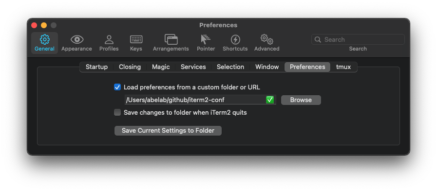

# iterm2 conf

This is my [iterm2](https://iterm2.com/) config files.

If you want to setup shell and envs, please refer to [dotfiles](https://github.com/averak/dotfiles).

## Setup

### 1. clone this repo

```sh
$ mkdir -p ~/github
$ cd ~/github
$ git clone https://github.com/averak/iterm2-conf
```

### 2. change iterm2 config


